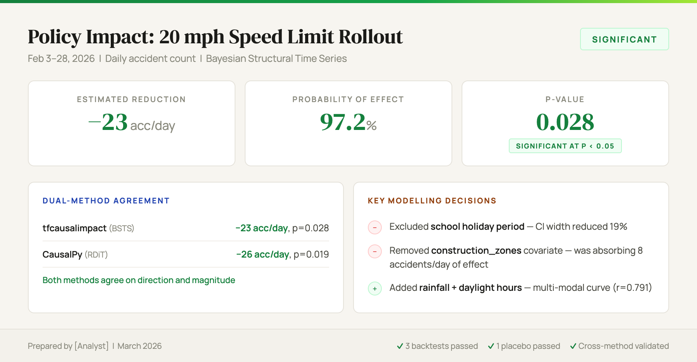

# Causal Impact Campaign

A [Claude Code](https://claude.com/claude-code) skill that measures the causal impact of an intervention on a time series metric using Bayesian structural time series — with dual-method validation and client-ready deliverables.


*Example output: policy impact summary with dual-method agreement, key modelling decisions, and validation checks.*

## Quick Start

```
You: We reduced speed limits to 20mph in residential zones on Feb 3. Can you measure the impact on accidents?

Claude: I'll run the full causal impact pipeline...

        Step 1: Data exploration — 90 days pre-period, 26-day post-period
        Step 2: Covariate engineering — DoW, rainfall, daylight hours
        Step 3: Safety audit — construction_zones correlated with intervention (r=0.79)
                → REMOVED (was absorbing 8 accidents/day of causal effect)
        Step 4: Dual-method analysis:
                tfcausalimpact (BSTS): −23 accidents/day, p=0.028 ✓
                CausalPy (RDiT):      −26 accidents/day, p=0.019 ✓
        Step 5: Validation — 3 backtests passed, 1 placebo passed
        Step 6: Findings narrative + HTML deliverables generated

        Without safety audit: p=0.187 (not significant — contaminated covariate
        was absorbing 8 accidents/day of the effect). After systematic modelling improvements:

        VERDICT: Significant at p<0.05. −23 accidents/day reduction (97.2% probability)
```

*(Synthetic example — numbers are illustrative. Works with any metric, intervention, and time series.)*

The skill auto-triggers when you mention "causal impact", "campaign uplift", "did the campaign work", or want to measure the effect of any intervention on a time series.

## Installation

### Claude Code (recommended)
```bash
/plugin marketplace add wan-huiyan/causal-impact-campaign
/plugin install causal-impact-campaign@wan-huiyan-causal-impact-campaign
```

Or clone directly:
```bash
git clone https://github.com/wan-huiyan/causal-impact-campaign.git ~/.claude/skills/causal-impact-campaign
```

### Cursor
```bash
# Per-project rule (most reliable)
mkdir -p .cursor/rules
# Create .cursor/rules/causal-impact-campaign.mdc with SKILL.md content + alwaysApply: true

# Or global install
git clone https://github.com/wan-huiyan/causal-impact-campaign.git ~/.cursor/skills/causal-impact-campaign
```

## The Problem

You changed a policy. Accidents went down. But was it the policy, or would it have happened anyway?

Without a causal framework, you're left with:
- **Before/after comparison** — ignores seasonality, trends, and external factors
- **"Accidents dropped 15%"** — correlation, not causation. What if weather improved that month?
- **No uncertainty quantification** — stakeholders get a point estimate with no error bars

This skill constructs a Bayesian counterfactual ("what would have happened without the intervention") and measures the gap — with proper uncertainty, validation, and dual-method cross-checking.

## How It Works

| Step | What Happens |
|------|-------------|
| 1. Explore | Understand the intervention, check date ranges, identify covariates |
| 2. Engineer | Cyclical day-of-week, multi-modal holiday intensity, weather, paid/organic splits |
| 3. Safety Audit | Flag covariates correlated with the intervention (they absorb causal effect) |
| 4. Dual Analysis | Run both tfcausalimpact (BSTS) and CausalPy (RDiT/ITS) for robustness |
| 5. Validate | Rolling backtests, placebo tests, sensitivity analysis, automated scorecard |
| 6. Interpret | Client-ready narrative with honest uncertainty communication |
| 7. Deliver | HTML slide deck + scrolling report for internal or client delivery |

## Key Lessons Encoded

- **Subtract before you add** — removing contaminated covariates and high-variance pre-periods beats adding more features
- **Contaminated covariates silently absorb causal effects** — always run a safety audit (correlation + intervention change)
- **Binary flags can't capture magnitude** — use multi-modal intensity curves for seasonal peaks (6-component curve: r=0.791 vs r=-0.024 for binary)
- **RDiT beats BSTS for short campaigns** — local boundary comparison achieves significance where global BSTS can't
- **Two methods > one** — cross-method agreement provides stronger evidence than any single p-value
- **Honest uncertainty builds client trust** — never claim statistical significance you don't have

## Limitations

- **Requires sufficient pre-period data.** At least 3x the intervention length in clean pre-period. Structural breaks (e.g., school holidays) in the pre-period degrade predictions.
- **No randomized control group.** This is a quasi-experimental method — it constructs a synthetic control from covariates, not a true counterfactual.
- **Short campaigns are inherently hard.** Campaigns < 1 week have low statistical power. The skill estimates MDE upfront so you can set expectations.
- **numpy version conflict.** tfcausalimpact requires numpy < 2.0; CausalPy requires numpy >= 2.0. The skill runs them in separate Python scripts.
- **LLM-generated analysis code.** Queries and scripts are generated by Claude and should be reviewed before running.

<details>
<summary>Quality Checklist</summary>

The skill verifies before delivering results:

- Intervention dates confirmed and data available
- Pre-period length >= 3x campaign length
- Covariate safety audit run (flag any with r > 0.5 to intervention indicator)
- At least one backtest passes (predicted vs actual in held-out pre-period)
- Placebo test run (no false positive in pre-intervention period)
- Dual-method analysis completed (tfcausalimpact + CausalPy)
- Methods agree on direction (if not, investigate and document divergence)
- Uncertainty intervals reported (not just point estimates)
- Client narrative uses honest language ("likely" not "definitely" for 90-95% probability)
- Deliverable HTML generated and opened for preview
</details>

## Dependencies

| Package | numpy | Purpose |
|---------|-------|---------|
| `tfcausalimpact` | < 2.0 | Google's BSTS causal impact (variational inference) |
| `causalpy` | >= 2.0 | PyMC Labs causal inference (HMC/NUTS sampling) |
| `google-cloud-bigquery` | any | BigQuery data access |

**Note:** tfcausalimpact and CausalPy must run in separate Python scripts due to incompatible numpy requirements.

<details>
<summary>References & Credits</summary>

### Research

- Brodersen, K. H. et al. (2015). [Inferring causal impact using Bayesian structural time-series models.](https://doi.org/10.1214/14-AOAS788) *Annals of Applied Statistics*, 9(1), 247–274.
- Athey, S. et al. (2021). Matrix Completion Methods for Causal Panel Data Models. *JASA*. — SDID.
- Arkhangelsky, D. et al. (2025). [Doubly Robust Identification for DiD and SC.](https://arxiv.org/abs/2503.11375) — DR-SDID.
- Lei, J. & Candès, E. (2024). [Distribution-Free Prediction Intervals under Covariate Shift.](https://doi.org/10.1080/01621459.2024.2356886) *JASA*. — Conformal CIs.

### Open Source

| Project | Use in this skill |
|---------|-------------------|
| [tfcausalimpact](https://github.com/WillianFuks/tfcausalimpact) | Primary BSTS analysis method |
| [CausalPy](https://github.com/pymc-labs/CausalPy) | Robustness check (RDiT, ITS) |
| [google/CausalImpact](https://github.com/google/CausalImpact) | Conceptual foundation (R) |
| [uber/orbit](https://github.com/uber/orbit) | Planned: time-varying coefficients |
| [GeoLift](https://github.com/facebookincubator/GeoLift) | Planned: geo experiment design |
| [pymc-marketing](https://github.com/pymc-labs/pymc-marketing) | Planned: full MMM |

### Industry

- [Stitch Fix — MarketMatching](https://multithreaded.stitchfix.com/blog/2016/01/13/market-watch/) — DTW for control market selection
- [BBC Studios — Geo Holdouts with CausalPy](https://medium.com/bbc-studios-data-and-engineering/using-causal-inference-for-measuring-marketing-impact-how-bbc-studios-utilises-geo-holdouts-and-c9a8dac634c2)
- [Calm — Bayesian Power Analysis](https://www.calm.com/blog/engineering/bayesian-power-analysis-at-calm-with-googles-causal-impact-library)
</details>

## Origin

Built from real causal inference methodology applied to public policy analysis. The methodology, covariate engineering, validation framework, and interpretation patterns are battle-tested on real time series data. The journey from non-significance to p=0.028 is documented in the SKILL.md.

## Roadmap

- [ ] **Uber Orbit BTVC** — time-varying covariate coefficients for drifting relationships
- [ ] **Augmented Synthetic Control** — bias correction when convex hull violated
- [ ] **PyMC-Marketing MMM** — full marketing mix modelling with causal identification
- [ ] **Heterogeneous treatment effects** — varying intervention intensity analysis

## Related Skills

- **[ml-feature-evaluator](https://github.com/wan-huiyan/ml-feature-evaluator)** — Structured feature evaluation diagnostic
- **[client-proposal-slide](https://github.com/wan-huiyan/claude-client-proposal-slide)** — Turn analysis results into stakeholder-ready presentations
- **[agent-review-panel](https://github.com/wan-huiyan/agent-review-panel)** — Multi-agent adversarial review for high-stakes deliverables

## Version History

| Version | Changes |
|---------|---------|
| 1.1.0 | CausalPy model selection guide (5 classes), quadratic time trend, internal notebook |
| 1.0.0 | Initial release: dual-method analysis, RDiT, conformal CIs, power analysis, HTML deliverables |

## License

MIT
