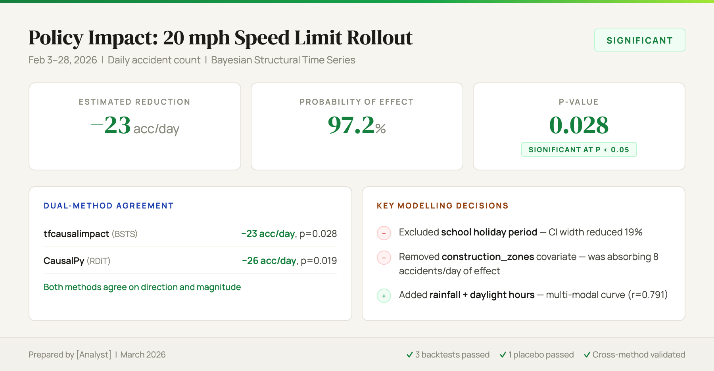
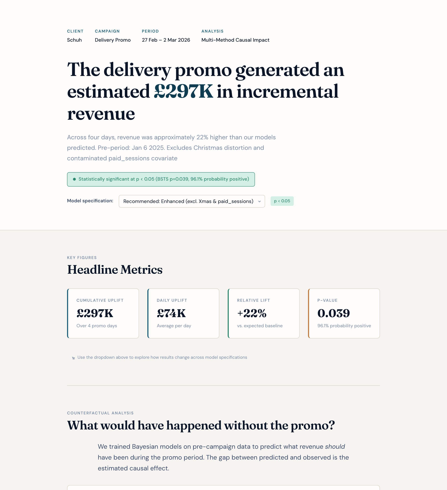

# Causal Impact Campaign

[](https://github.com/wan-huiyan/causal-impact-campaign/releases) [](LICENSE) [](https://www.python.org/) [](eval-suite.json) [](references/bibliography.md) [](https://claude.com/claude-code) [](https://github.com/wan-huiyan/causal-impact-campaign/commits)

**Measure whether your campaign actually worked — not just "revenue went up."**

Bayesian counterfactual analysis with multi-method validation, permutation testing, and client-ready deliverables. A [Claude Code](https://claude.com/claude-code) skill that automates the full pipeline so you get a defensible estimate instead of a naive before/after comparison.



## Install

This skill is distributed as a Claude Code **plugin**. Installation is two steps: add the marketplace, then install the plugin.

### Inside a Claude Code session (recommended)

```text
/plugin marketplace add wan-huiyan/causal-impact-campaign
/plugin install causal-impact-campaign@wan-huiyan-causal-impact-campaign
```

### From the terminal

```bash
# 1. Register this repo as a marketplace (one-time)
claude plugin marketplace add wan-huiyan/causal-impact-campaign

# 2. Install the plugin
claude plugin install causal-impact-campaign@wan-huiyan-causal-impact-campaign
```

### Updating to the latest version

```bash
# Refresh the marketplace catalog, then update the installed plugin
claude plugin marketplace update wan-huiyan-causal-impact-campaign
claude plugin update causal-impact-campaign@wan-huiyan-causal-impact-campaign
```

### Alternative: clone directly

```bash
git clone https://github.com/wan-huiyan/causal-impact-campaign.git \
  ~/.claude/skills/causal-impact-campaign
```

> **Note:** The plugin name is `causal-impact-campaign` (from `plugin.json`). The marketplace name is `wan-huiyan-causal-impact-campaign` (from `marketplace.json`). They look similar but are different — the `@marketplace` suffix is required when installing.
>
> `claude skill install` is deprecated; use `claude plugin install` instead.

**Requires:** Claude Code, Python 3.9+. Optional: GCP project for Cloud Run batch processing.

**Not for:** A/B tests with randomized control groups, multi-touch attribution, time series forecasting, media mix modeling, or general dashboards.

## Quick Start

Example output:
```
You: We ran a free delivery promo for 10 days. Did it actually increase revenue?
     We have daily GA4 data in BigQuery.

Claude: [runs full pipeline — data exploration, covariate safety audit, 4-method
         analysis, permutation validation, client-ready HTML]

        BSTS:  +22%, p=0.04, 96% probability positive
        RDiT:  +18%, CI excludes zero
        Both methods agree on direction and magnitude.

        Without safety audit: p=0.187 (contaminated covariate was absorbing
        the effect). After removing it: p=0.04. This is why the audit matters.
```

Auto-triggers on: "causal impact", "campaign uplift", "did the campaign work", "measure uplift", "promo effect", "incrementality", "is my BSTS overfit", "false positive rate", "validate my permutation test".

## Why This Exists

Without a causal framework, you get:
- **"Revenue went up 15%"** — but was it the campaign, or would it have happened anyway?
- **Contaminated covariates silently absorb your effect** — a real p<0.05 result looks like p=0.19 when you include a covariate affected by the intervention

This skill constructs a Bayesian counterfactual, runs a safety audit on every covariate, cross-validates with multiple methods, and validates with permutation tests before you report anything.

### vs. Alternatives

| Tool | What it does | This skill adds |
|------|-------------|----------------|
| [Google CausalImpact](https://google.github.io/CausalImpact/) (R) | Single-method BSTS | Multi-method validation, covariate safety audit, permutation testing, FPR calibration |
| [tfcausalimpact](https://github.com/WillianFuks/tfcausalimpact) (Python) | Python port, simple API | Same as above, plus automated covariate engineering and client deliverables |
| [Meta GeoLift](https://github.com/facebookincubator/GeoLift) | Geo-level synthetic control | Works on single time series (no geo holdout needed), 440-spec robustness sweep |
| [CausalPy](https://github.com/pymc-labs/CausalPy) | Bayesian ITS + RDiT | Wraps CausalPy as one of 4+ methods, adds the validation layer on top |

## How It Works

| Step | What Happens |
|------|-------------|
| 1. Understand | Establish intervention dates, channels, concurrent campaigns |
| 2. Explore | Check date ranges, seasonality, paid vs organic split |
| 3. Engineer | Cyclical day-of-week, holiday intensity curves, weather, sale detection |
| 4. Safety Audit | Flag covariates correlated with intervention — they absorb causal effect |
| 5. Multi-Method | Run BSTS (VI + HMC), CausalPy, RDiT, Conformal CIs, Prophet |
| 6. Validate | Permutation tests (effect-size comparison), placebo FPR calibration, rolling backtests |
| 7. Interpret | Honest uncertainty communication with prob_positive framing |
| 8. Deliver | Interactive HTML explorer + findings doc + spec curve chart |

## What Makes This Different

1. **All methods are miscalibrated.** We tested BSTS VI, BSTS HMC, Prophet, and RDiT on placebo data — all show 35-55% false positive rates. The skill gates every result through permutation testing (effect-size comparison, not p-values) to provide honest significance.

2. **Covariate safety audit catches the #1 silent failure.** A covariate that changed during the intervention absorbs your causal effect, biasing estimates toward zero. The skill tests each covariate and flags INCLUDE/CAUTION/SKIP.

3. **440-spec Specification Curve Analysis.** Instead of reporting one cherry-picked p-value, the skill tests all analytical "forking paths" — 55 covariate bundles x 8 infrastructure combos — and reports the full distribution.

4. **Honest reporting framework.** Converts p-values to "probability of positive effect" for non-technical stakeholders. Distinguishes confirmatory (pre-registered) from exploratory (post-hoc) results. Never claims significance you don't have.

5. **34 research-backed eval assertions.** The eval suite tests methodology correctness against 25+ academic papers (Abadie 2010, Brodersen 2015, Eggers 2024, Young 2019, Roth 2022, and more).

## Companion Skills

| Skill | Purpose |
|-------|---------|
| [data-provenance-verifier](https://github.com/wan-huiyan/data-provenance-verifier) | Verify external data files (weather, Trends CSVs) are genuine before analysis |
| [cloud-run-batch-experiment](https://github.com/wan-huiyan/cloud-run-batch-experiment) | Scale permutation tests and SCA to GCP Cloud Run Jobs (~$3.07 for 440 specs) |
| [client-proposal-slide](https://github.com/wan-huiyan/claude-client-proposal-slide) | Create stakeholder-ready presentation from findings |

**Merged skills:** `permutation-validation` and `bsts-placebo-calibration` are now built into this skill (v2.0.0). If you have them installed separately, you can uninstall them.

## Version History

| Version | Date | Changes |
|---------|------|---------|
| **2.2.0** | 2026-04-07 | New section: "Data-Prep Zero-Injection Trap" — latent bug class where `mask` + `prep_df` silently fills masked days with `y=0` + interpolated covariates instead of removing them. Affects all methods except RDiT (which uses a local bandwidth window). Includes reproduction recipe, verification pattern, and 4 fix options. Discovered via the Schuh retail engagement (Issue #51). Pitfall #13 added. Prior "masking passes permutation" guidance corrected. FPR section updated with caveat. |
| **2.1.0** | 2026-04-02 | 34 research-backed eval assertions, trigger keywords for merged content |
| **2.0.0** | 2026-04-02 | Merged permutation-validation + bsts-placebo-calibration, reference files architecture, data-provenance-verifier companion |
| **1.6.0** | 2026-03-25 | SCA (440-spec sweep), VI stochasticity warning, 9 methods |
| **1.0.0** | 2026-03-15 | Initial release: dual-method analysis, covariate safety audit, client deliverables |

<details>
<summary>Interactive Explorer</summary>

The skill generates a **single self-contained HTML file** the client opens in their browser — no server, no install, works offline.

**What the client can do:**
- Switch model specifications via dropdown — all metrics update live
- Explore the counterfactual chart with Plotly.js (zoom, pan, hover)
- Compare methods side-by-side with CI error bars
- Drill into effect decomposition (Conversion Rate, Transactions, AOV)



</details>

<details>
<summary>Specification Curve Analysis</summary>

The SCA tests all analytical "forking paths" across two dimensions:

**Infrastructure (8 combos):** 4 pre-period modes (full, mask BF-Jan, mask Nov-Jan, post-holiday trimmed) x 2 seasonality (weekly, biweekly).

**Enrichments (55 bundles in 6 groups):** DoW encoding, calendar signals, weather, external signals (Google Trends), sale detection, transforms.

Output: spec curve chart (440 bars sorted by effect, CI whiskers), indicator matrix, dimension impact analysis, permutation p-values for top specs.

</details>

<details>
<summary>Case Study: The Path to a Validated Result</summary>

See [docs/case-study.md](docs/case-study.md) for the full journey from p=0.22 to a permutation-validated result — including the meta-lesson that removing things (contaminated covariates, high-variance pre-periods) beats adding them.

</details>

<details>
<summary>Limitations</summary>

- **Requires sufficient pre-period data.** At least 3x intervention length. Structural breaks degrade predictions.
- **No randomized control group.** This is quasi-experimental — constructs a synthetic control from covariates.
- **Short campaigns are inherently hard.** Campaigns < 1 week have low statistical power. The skill estimates MDE upfront.
- **All built-in methods show elevated FPR (35-55%).** The skill mitigates this with permutation testing, but practitioners should understand the limitation.
- **numpy version conflict.** tfcausalimpact (numpy < 2) and CausalPy (numpy >= 2) must run in separate scripts.
- **CausalPy fails on short treatment windows** (< 7 days) with xarray dimension error. Use RDiT as lead method.

</details>

<details>
<summary>Dependencies</summary>

| Package | numpy | Purpose |
|---------|-------|---------|
| `tfcausalimpact` | < 2.0 | Google's BSTS causal impact |
| `causalpy` | >= 2.0 | PyMC Labs causal inference (ITS, RDiT) |
| `prophet` | any | Meta's forecasting (cross-validation method) |
| `google-cloud-bigquery` | any | BigQuery data access |

Python 3.9-3.12. macOS requires `cores=1` in CausalPy sample_kwargs.

</details>

<details>
<summary>References</summary>

Full bibliography: [references/bibliography.md](references/bibliography.md)

**Core:** Brodersen et al. (2015), Scott & Varian (2014), Abadie et al. (2010, 2015, 2021)

**Validation:** Eggers et al. (2024), Young (2019), Linden (2018), Athey & Imbens (2017)

**Calibration:** Gils et al. (2022), Peduzzi et al. (1996), Oelrich et al. (2020)

**Communication:** Makowski et al. (2019), Gelman & Yao (2021), Muehlemann et al. (2023)

**Eval suite:** Roth (2022), Simonsohn et al. (2020), Duan (1983), Campbell & Kenny (1999), Malani & Reif (2015), Vehtari et al. (2017)

</details>

## License

MIT
